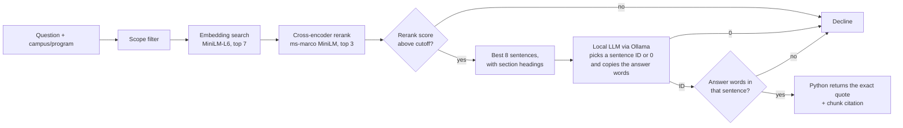

# Margin: Campus Knowledge Assistant

Margin answers questions about Rutgers using public university
documents, and it only answers with evidence. Every answer is an exact
quote from a source document with a citation, and when the documents do
not contain the answer, Margin says so instead of guessing.

The language model never writes the answer text. It only chooses which
retrieved sentence answers the question (or chooses none). Python then
copies that sentence from the source and attaches the chunk ID, so an
answer cannot contain wording that is not in a document.

## How it works



**Preparing documents**

1. `collect.py` downloads an explicit allowlist of Rutgers pages into a
   dated staging folder with content hashes. Nothing reaches the index
   until it has been reviewed and copied to `data/raw/`.
2. `ingest.py` splits each document into sentences with
   `text_units.py` and packs them into chunks (about 150 words, with up
   to 30 words of whole-sentence overlap). Sentences never cross a line
   break, so web page headings and list items are not glued onto the
   next sentence. Headings are detected and kept as context for the
   sentences below them, but are never offered as answers.
3. `embed.py` embeds each chunk with `all-MiniLM-L6-v2` and fails if any
   chunk is longer than the model's input limit.

**Answering questions**

1. `search.py` keeps only chunks that match the requested campus and
   program (university-wide documents always match), then ranks them by
   cosine similarity.
2. `rerank.py` rescores the top 7 with a cross-encoder and keeps 3.
3. `generate.py` scores each sentence of those passages against the
   question and offers the best 8 to the model, each with its section
   heading. A JSON schema only allows the offered IDs or 0 (decline).
   The model must also copy the words that state the answer; if those
   words are not in the chosen sentence, the answer is declined.
4. `api.py` serves `POST /ask`, `POST /search`, `GET /health`, and the
   web interface in `static/index.html`.

## Results

Benchmark of 60 labeled questions (40 answerable, 20 not answerable
from the documents), `qwen2.5:3b`. Details, caveats, and a reverted
experiment are in [docs/evaluation.md](docs/evaluation.md).

| Metric | Before | Now |
|---|---|---|
| Hit@1, embedding only → with reranking | 0.775 → 0.900 | 0.775 → **0.900** |
| Correct declines on unanswerable questions | 7/20 | **14/20** |
| False declines on answerable questions | 0/40 | **0/40** |
| Answers quoting the right sentence | not measured | **34/40** |
| Verbatim citation validity | 100% | **100%** |
| Regression checks | 11/12 | **12/12** |
| Median latency after warm-up | 0.82 s | 1.32 s |

The remaining errors are mostly sentences that point to information
("View steps on how to...") being chosen instead of sentences that
state it.

## Setup

Requires Python 3.12 or newer and [Ollama](https://ollama.com).

```bash
python3 -m venv .venv
source .venv/bin/activate
pip install -r requirements-dev.txt

ollama pull qwen2.5:3b

python ingest.py   # data/raw -> data/processed/chunks.json
python embed.py    # chunks -> data/processed/embeddings.npy
uvicorn api:app --reload
```

Open http://127.0.0.1:8000.

Settings such as the Ollama URL and model can be overridden with
environment variables; see `config.py` and `.env.example`.

## Testing and evaluation

```bash
pytest                 # fast unit tests, no models or Ollama needed
python evaluate.py     # 12 regression cases (needs Ollama)
python benchmark.py    # full 60-question benchmark (needs Ollama)
python data/evaluation/relabel.py   # recompute gold labels after re-chunking
```

## Project layout

```
config.py            shared settings
collect.py           fetch allowlisted pages into data/staging/
text_units.py        sentence, heading, and section detection
ingest.py            chunking
embed.py             chunk embeddings
search.py            scope filter + embedding search
rerank.py            cross-encoder reranking
generate.py          evidence selection and validation
api.py               FastAPI app
static/index.html    web interface
evaluate.py          regression checks
benchmark.py         labeled benchmark
data/documents.json  document catalog and metadata
data/raw/            reviewed document text
data/evaluation/     benchmark questions, evidence phrases, labels
docs/                evaluation notes
tests/               unit tests
```

## Documents

Five public Rutgers pages: MS CS degree requirements, interlibrary
loan, eduroam, two-step login with Duo, and Microsoft Office. See
[data/sources.md](data/sources.md).

## Limitations

- The corpus is small, and the benchmark questions were written from
  the same documents.
- An answer is a single sentence, so answers that span several
  sentences are incomplete.
- Campus and program must be chosen explicitly; they are not detected
  from the question.
- Quotes are verified to exist in the source, not to answer the
  question.

## Roadmap

- [x] Clean sentence boundaries and section context
- [x] Better declines for unanswerable questions (7/20 → 14/20)
- [ ] Stop choosing "pointer" sentences (links, "learn more" text)
- [ ] Multi-sentence answers with every claim tied to a quote
- [ ] Larger corpus of Rutgers pages
- [ ] Postgres + pgvector storage and hybrid (BM25 + vector) search
- [ ] Role-based access to documents
- [ ] Ragas evaluation, Langfuse tracing, and CI
- [ ] Docker Compose setup and a hosted demo
